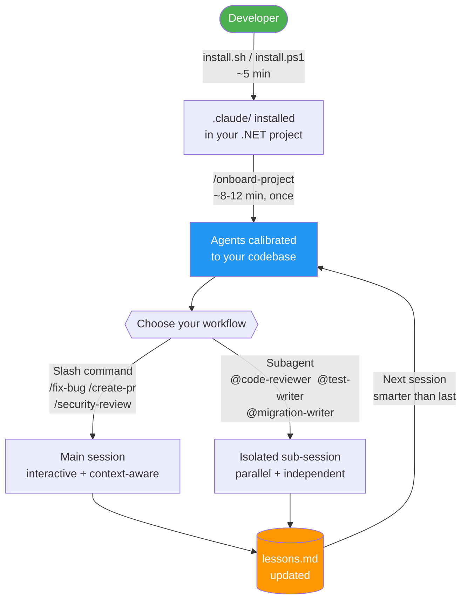

# claude-code-dotnet-starter

> **Your .NET codebase. A full team of AI engineers. Five minutes to install.**

Stop re-explaining your stack to an AI that forgets everything between sessions. `claude-code-dotnet-starter` embeds a crew of specialized Claude Code agents directly into your .NET Core project — agents that already know your architecture, conventions, and domain rules before you type a single prompt.

One installer. One onboarding command. Permanent, project-aware AI that gets smarter every sprint.

[](https://github.com/YOUR-USERNAME/claude-code-dotnet-starter/actions/workflows/ci.yml)
[](LICENSE)
[](https://dotnet.microsoft.com)
[](CONTRIBUTING.md)
[](https://claude.ai/code)

---

## Table of Contents

- [Why this exists](#why-this-exists)
- [How it works](#how-it-works)
- [Quick start](#quick-start)
- [What's in the box](#whats-in-the-box)
- [Skills vs Subagents](#skills-vs-subagents)
- [Layout](#layout-source-library)
- [Supported runtimes](#supported-runtimes)
- [Updating an installed copy](#updating-an-installed-copy)
- [Customising for a project](#customising-for-a-project)
- [Comparison vs alternatives](#comparison-vs-alternatives)
- [FAQ](#faq)
- [Use Case Examples](#use-case-examples)
- [Contributing](#contributing)
- [License](#license)

---

## Why this exists

Every .NET team ends up writing the same boilerplate prompts: "review this for EF Core N+1 issues", "check this PR for async safety", "generate xUnit tests for this service." This library turns those one-off prompts into **repeatable, project-aware AI workflows** that already know your stack, your conventions, and your architecture — and get smarter the more you use them.

### What you get

| Without this library | With this library |
|----------------------|-------------------|
| Write a new prompt every time | Invoke `/fix-bug`, `/security-review`, `/create-pr` — done |
| Generic AI that doesn't know your project | Agents calibrated to your CLAUDE.md, context files, and lessons |
| Manual code review before every PR | `@pr-reviewer` runs a 13-category checklist automatically |
| "How do I write an EF Core migration safely?" | `@migration-writer` generates expand-contract migrations with idempotent SQL |
| Re-explaining your architecture every session | Session hook flattens all context into one file agents read at startup |

### Key features

- **8 expert subagents** — architecture, code review, PR review, doc generation, test writing, migration safety, refactoring, and lesson curation; each runs in its own isolated sub-session
- **12 skills (slash commands)** — `fix-bug`, `security-review`, `review-pr`, `optimize-performance`, `create-pr`, `update-deps`, plus four expert personas (`/agent-developer`, `/agent-architect`, `/agent-reviewer`, `/agent-security`)
- **One-command onboarding** — `/onboard-project` scans your codebase and calibrates all agents to your stack, naming conventions, and domain rules (~8–12 min, runs once)
- **Persistent lessons** — `@lesson-curator` distils review findings into `.claude/lessons.md`; every future session benefits from what the agents previously caught
- **Session context hook** — flattens CLAUDE.md + context files + lessons into a single `agent-context.md` at startup so subagents need one Read, not four
- **Manifest-tracked installer** — re-runs safely; `--force` refreshes bootstrap files without touching your team's customizations
- **Cross-platform** — `install.ps1` for Windows, `install.sh` for Linux / macOS / WSL

---

## How it works



**The key insight:** agents don't forget. Every code review finding the agents catch gets curated by `@lesson-curator` into `lessons.md`. The session hook loads that file at startup. Your AI pair programmer gets smarter with every sprint.

---

## Quick start

**Before you run:** in the target project, `git checkout main` (or `master` / `trunk`) and confirm a clean working tree. The installer detects your current branch and prompts if you're elsewhere.

```powershell
# Windows
powershell -ExecutionPolicy Bypass -File .\setup\install.ps1 -TargetPath C:\path\to\YourDotNetProject
```

```bash
# Linux / macOS / Git Bash / WSL
./setup/install.sh /path/to/YourDotNetProject
```

Then inside the target project, launch Claude Code and run:

```
/onboard-project
```

That's it. The skill covers 12 phases (0–11): branch check (0), service discovery + codebase deep dive (1–2), CLAUDE.md population (3), context file initialisation (4), Lesson Candidates emission (5), skill alignment (6), BOOTSTRAP_PENDING.md cleanup (7), lesson curation via `@lesson-curator` (8), session-log entry (9), mechanical verification (10), and final report (11). **Total: ~8–12 min** for most projects; larger codebases (500+ files) may take slightly longer as Phase 1–2 scans scale with project size.

The installed `settings.json` includes a `defaultMode: acceptEdits` setting and an `allow` list for common dotnet/git/gh commands — Claude Code won't prompt for permission on routine operations like `dotnet build`, `dotnet test`, `git status`, or `gh pr list`.

Full workflow + manifest tracking + troubleshooting: [setup/INSTALL.md](setup/INSTALL.md).

---

## What's in the box

### 8 subagents (`Personas/`)

| Agent | Purpose |
|-------|---------|
| `architecture-reviewer` | Clean Architecture, DI, observability, resilience, K8s readiness |
| `code-reviewer` | C# correctness, async safety, EF Core, SOLID, modern .NET idioms |
| `pr-reviewer` | Pre-merge breaking changes, EF migration safety, CI/CD delta |
| `doc-generator` | XML docs, Swagger annotations, README sections, ADRs |
| `test-writer` | xUnit + Testcontainers + Verify + Stryker + NetArchTest + NBomber |
| `migration-writer` | Safe EF Core migrations: expand-contract, idempotent SQL, reversible `Down()` |
| `refactoring-agent` | Dead code, duplication, long methods, god classes — proposes and applies safe refactors |
| `lesson-curator` | Distils review-agent findings into `.claude/lessons.md` (only agent that writes there) |

### 12 skills (`.claude/skills/`)

Skills are invoked with a slash command and run in the **main session**. Three categories:

**Onboarding**

| Skill | Purpose |
|-------|---------|
| `onboard-project` | Post-install deep customization (12 phases, 0–11). Scans the codebase, populates CLAUDE.md Project Facts + scaffold sections, initialises 3 context files, aligns bootstrap and persona skills, emits Lesson Candidates, curates `lessons.md`, seeds the session log. Run once after install. |
| `customize-service-setup` | Detects domain category patterns in the codebase and auto-generates service-specific skill stubs, then re-runs Phase 6 skill alignment. Run after install, after adding service-specific skills, or after a `--force` installer update. |

**Daily workflows**

| Skill | Purpose |
|-------|---------|
| `fix-bug` | Diagnose and fix .NET bugs: gather evidence → identify root cause → apply minimal fix → write regression test → verify with `dotnet test` |
| `create-pr` | Draft a PR title (`feat/fix/refactor: summary`) and body (summary / breaking changes / migration steps / test plan), then run `gh pr create` |
| `update-deps` | Audit NuGet packages for vulnerabilities (`dotnet list package --vulnerable`), plan by risk group (security → patch → minor → major), apply and verify each group |

**Security & performance**

| Skill | Purpose |
|-------|---------|
| `security-review` | ASP.NET Core security audit: OWASP Top 10 (A01–A09), JWT / Data Protection / CORS / anti-forgery / secrets, plus microservice-specific checks (service-to-service auth, rate limiting, NuGet supply chain) |
| `review-pr` | Fetch a GitHub PR by number, run the full 13-category `@pr-reviewer` checklist, and post findings as GitHub review comments — inline per-line (GitHub MCP) or single review comment (`gh` CLI fallback) |
| `optimize-performance` | Measure-first optimization: EF Core (N+1, `AsNoTracking`, projections), async/threading (blocking calls, `WhenAll`, `IDbContextFactory`), memory (`Span<T>`, string concat, boxing), caching (`IMemoryCache` vs `IDistributedCache`), Polly retry storms |

**Expert personas** (activate for the duration of your session)

| Skill | Purpose |
|-------|---------|
| `agent-developer` | Senior C#/.NET developer persona — enforces async-first, nullable, DI-first, thin controllers, modern idioms (primary constructors, pattern matching, `required`, records); pushes back on `.Result`, `DbContext` in singletons, static state |
| `agent-architect` | Senior .NET architect persona — Clean Architecture layering, CQRS, hosted-service topologies, outbox pattern, health checks, ProblemDetails, API versioning, OpenTelemetry |
| `agent-reviewer` | Adversarial code reviewer persona — 4-layer review (Correctness → Security → Reliability → Maintainability) with BLOCK / WARN / SUGGEST / PROBING QUESTIONS verdict format |
| `agent-security` | Security engineer persona — STRIDE threat modelling, auth design, incident response workflows; security non-negotiables for every .NET service |

### 3 baseline rules (`.claude/rules/`)

`coding-standards.md` (C# / .NET — naming, async, null safety, EF Core, SOLID, Minimal APIs, DDD tactical patterns), `git-workflow.md` (branch naming, conventional commits, PRs), `testing.md` (xUnit, Moq, integration tests, Testcontainers). Auto-loaded into every session.

### 2 output styles (`.claude/output-styles/`)

`terse` (minimal output — no narration, no preambles) and `teaching` (explanatory output — pair-programming with juniors). Switchable per developer.

### 6 prompts (`.claude/prompts/`)

| Prompt | Use |
|--------|-----|
| `system-design.md` | Generate `docs/system-design.md` with mermaid diagrams |
| `bug-report.md` | Bug investigation template (pair with `/fix-bug`) |
| `feature-request.md` | Lightweight feature spec — fill in the brackets, invoke directly |
| `architecture-decision.md` | ADR template (pair with `@architecture-reviewer`) |
| `code-review-request.md` | Focused code-review (pair with `@code-reviewer`) |
| `technical-debt.md` | Debt-prioritisation (pair with `@refactoring-agent`) |

### 4 hook scripts (`.claude/scripts/`)

- `session-start.{sh,ps1}` — flattens CLAUDE.md + `.claude/context/*.md` + lessons.md + last 3 session-log entries into `agent-context.md` (single Read for subagents); fires staleness reminders
- `session-end.{sh,ps1}` — trims session-log to last 10, lessons.md to last 20 bullets, auto-discards old pending markers

---

## Skills vs Subagents

The library ships **two kinds of Claude capabilities** that are complementary and freely mixed.

**Skills** (`/skill-name`) run in the **main session** — same conversation as the user. Each skill loads a self-contained workflow or persona into Claude's current context. Best for: persona modes, interactive single-developer workflows, and tasks that need conversation history.

**Subagents** (`@agent-name` or the Agent tool) run in an **isolated sub-session**. They have their own tool access, don't see the main conversation, and read project context via a single Read of `.claude/agent-context.md`. Best for: parallel work, independent second opinions, generation tasks, and review chains.

| | Skills | Subagents |
|---|---|---|
| Invocation | `/skill-name` | `@agent-name` or Agent tool |
| Session | Main (shared) | Isolated sub-session |
| Parallel execution | No | Yes |
| Context source | Current conversation | `.claude/agent-context.md` |
| Best for | Personas, interactive workflows | Reviews, generation, parallel tasks |

Use skills when you want Claude to *become* something (a developer, architect, security reviewer) or to walk you through a structured process. Use subagents when you want an independent agent to *do* something (review, generate, migrate) and report back.

---

## Layout (source library)

```
.
├── README.md                              (this file)
├── CLAUDE.md                              (identity, rules, agent dispatch — scaffold template for target projects)
├── Personas/                              (8 agent definition sources)
├── .claude/
│   ├── skills/
│   │   ├── onboard-project/               (post-install customization skill — 12 phases, 0–11)
│   │   ├── customize-service-setup/       (detect domain patterns → generate stubs → re-run Phase 6 skill alignment)
│   │   ├── fix-bug/                       (diagnose → fix → regression test)
│   │   ├── create-pr/                     (PR title + body + gh pr create)
│   │   ├── update-deps/                   (NuGet audit → risk-grouped updates)
│   │   ├── security-review/               (OWASP + ASP.NET Core + microservice checks)
│   │   ├── review-pr/                     (fetch GitHub PR → pr-reviewer checklist → post inline comments)
│   │   ├── optimize-performance/          (EF Core / async / memory / caching)
│   │   ├── agent-developer/               (senior C# developer persona)
│   │   ├── agent-architect/               (senior .NET architect persona)
│   │   ├── agent-reviewer/               (adversarial reviewer persona)
│   │   └── agent-security/                (security engineer persona)
│   ├── rules/                             (baseline coding / git / testing standards)
│   └── output-styles/                     (terse / teaching)
└── setup/
    ├── INSTALL.md                         (full setup workflow + upgrade docs)
    ├── install.ps1                        (Windows; manifest-aware, --Force supported)
    ├── install.sh                         (Linux / macOS / WSL; manifest-aware, --force supported)
    └── templates/
        ├── settings.json                  (permissions block + hooks — copied to target on install)
        ├── context/
        │   ├── architecture.md            (service type, data flow, boundaries — template)
        │   ├── tech-stack.md              (runtime + NuGet packages table — template)
        │   └── coding-standards.md        (naming, async, EF Core, logging conventions — template)
        ├── system-design.md
        ├── session-{start,end}.{sh,ps1}
        ├── prompts/                       (5 task templates)
        └── examples/                      (.gitignore)
```

---

## Supported runtimes

Targets **.NET Core and later** — .NET Core 3.1+, .NET 5, .NET 6, .NET 7, .NET 8 (LTS), .NET 9, and future releases. Version-specific features carry an `(.NET 8+)` / `(.NET 9+)` annotation so the minimum required runtime is always visible.

---

## Updating an installed copy

The installer tracks every file it copies in `.claude/BOOTSTRAP_MANIFEST.json`. Re-runs use the manifest to know which files came from bootstrap (safe to refresh with `--force`) vs which came from your team (never touched).

```bash
# Default — picks up new bootstrap files; preserves all existing
./setup/install.sh /path/to/your/project

# --force — also refreshes bootstrap-origin files; never touches service-specific files or CLAUDE.md
./setup/install.sh /path/to/your/project --force
```

---

## Customising for a project

A one-time customization pass (~8–12 minutes) makes the generic agents project-aware:

1. **Install** — run `setup/install.sh` (or `.ps1`)
2. **`/onboard-project`** — single skill does everything: scans the codebase, populates CLAUDE.md Project Facts + scaffold sections, initialises 3 context files (`.claude/context/architecture.md`, `.claude/context/tech-stack.md`, `.claude/context/coding-standards.md`), emits Lesson Candidates, runs `@lesson-curator` (auto-applies), writes session-log entry, runs mechanical verification

The agents themselves are never edited — specialisation happens at runtime via `CLAUDE.md`, the context files, and `lessons.md`. Step-by-step detail with examples: [setup/INSTALL.md](setup/INSTALL.md#after-install--customization-workflow).

---

## Comparison vs alternatives

| | **claude-code-dotnet-starter** | Raw Claude Code | Cursor rules | GitHub Copilot |
|---|---|---|---|---|
| Knows your architecture | ✅ After `/onboard-project` | ❌ Explain each session | Partial | ❌ |
| .NET-specific agents | ✅ 8 specialized | ❌ Generic | ❌ Generic | Partial |
| Persistent learning | ✅ `lessons.md` grows each sprint | ❌ | ❌ | ❌ |
| PR review (13 categories) | ✅ `@pr-reviewer` | Manual prompt | Manual | Inline only |
| EF Core migration safety | ✅ expand-contract + idempotent SQL | ❌ | ❌ | ❌ |
| OWASP security audit | ✅ `/security-review` | Manual prompt | ❌ | ❌ |
| Architecture review | ✅ `@architecture-reviewer` | Manual prompt | ❌ | ❌ |
| NuGet vulnerability audit | ✅ `/update-deps` | ❌ | ❌ | ❌ |
| Works offline | ✅ (no internet needed post-install) | ✅ | ✅ | ❌ |
| Open source | ✅ MIT | N/A | N/A | ❌ |
| Cost | Claude subscription | Claude subscription | Cursor subscription | GitHub Copilot |

> **TL;DR:** Raw Claude Code is powerful but stateless. Cursor rules are static text. GitHub Copilot is great for inline completion. This toolkit layers *project memory*, *specialized .NET workflows*, and *agent orchestration* on top of Claude Code — things the others don't do.

---

## FAQ

**Does this work with older .NET versions?**
Yes. The toolkit targets .NET Core and later. Agents annotate .NET 8+/9+ features explicitly so you always know what's version-specific.

**What does it cost?**
Only your Claude subscription. The toolkit itself is MIT-licensed and free. No extra API calls are made; agents run entirely within Claude Code's normal session budget.

**Does it send my code to Anthropic?**
The same way any Claude Code session does — your code is sent to Claude to process your requests. No additional data collection beyond normal Claude Code usage. Review [Anthropic's privacy policy](https://www.anthropic.com/privacy) for details.

**Does it work with JetBrains Rider, Visual Studio, or VS Code?**
Yes. Claude Code runs as a CLI tool, independent of your IDE. Install it in the project directory and use it alongside whichever editor you prefer.

**Does this replace GitHub Copilot?**
No — they're complementary. Copilot excels at inline completion while you type. This toolkit handles higher-level workflows: architecture review, migration safety, security audit, test generation, and PR review. Many teams use both.

**What if I don't use Clean Architecture?**
Fully supported. The toolkit defaults to Clean Architecture as a starting point, but `/onboard-project` detects your actual structure (Vertical Slice, Modular Monolith, N-tier, etc.) and writes it to `lessons.md`. All agents then adapt their checks to your pattern.

**Can I add my own custom agents or skills?**
Yes. Drop a new file into `.claude/skills/` or `Personas/` in the target project and run `/customize-service-setup` to wire it into the routing. See [CONTRIBUTING.md](CONTRIBUTING.md) if you'd like to contribute it back to the library.

**How do I keep the toolkit up to date?**
Re-run the installer from the latest version of this repo. It uses the manifest to update only bootstrap-origin files — your customizations, CLAUDE.md edits, and lessons.md are never touched.

---

## Use Case Examples

Concrete prompts to invoke each prompt or agent. Placeholders (`OrderService`, `Invoice`, `Reports`) stand in for whatever your project actually has — adapt to your domain.

### `/onboard-project` (skill — first run)

- First run after `./setup/install.ps1` (or `./setup/install.sh`) completes. Takes the project from "generic library installed" to "agents calibrated, context files populated, lessons.md curated". Total ~8–12 min.
- Re-run after a major refactor (new module added, layering changed, primary stack swapped).
- Re-run after a long pause (project untouched for 6+ months).

### `/customize-service-setup` (skill — detect patterns + generate stubs)

- "I just added a `/add-device` skill. Wire it into `agent-developer` and `agent-architect` routing."
- "A `--force` installer update wiped the routing sections from my persona skills — restore them."
- "Scan the codebase — I think we have multiple device categories. Generate the meta-router and workflow stubs."

### `/fix-bug`

- "Users see a 500 on `POST /api/orders`. Stack trace: `InvalidOperationException: A second operation was started on this context`. Fix it."
- "`dotnet test` hangs on `OrderServiceTests.ProcessAsync_ShouldRetry`. Diagnose the deadlock and write a regression test."
- "The `RefundCalculator` returns negative amounts for partial refunds. Here's the failing test — find the root cause and fix it."

### `/create-pr`

- "I've finished the `Refunds` feature — create the PR. Title, body (summary / breaking changes / migration / test plan), then push and open it."
- "Create a PR for this EF Core migration. Flag zero-downtime risks in the body."

### `/update-deps`

- "Audit all NuGet packages for vulnerabilities and outdated versions. Group updates by risk and show me the plan before applying anything."
- "Just scan for security vulnerabilities — don't propose minor/major upgrades yet."

### `/security-review`

- "Run an OWASP Top 10 check on this service. Focus on A01–A05."
- "Review the JWT authentication setup in `Program.cs` — audience, issuer, expiry, key strength."

### `/review-pr`

- `/review-pr 247` — fetches PR 247, runs the full 13-category checklist, posts inline comments via GitHub MCP.
- `/review-pr` (no number) — detects the open PR for the current branch automatically.

### `/optimize-performance`

- "The `GET /api/reports` endpoint is slow. Start with EF Core analysis — look for N+1 queries and missing projections."
- "Review `OrderProcessingService` for async/threading issues: blocking `.Result` calls, missing cancellation tokens."

### `/agent-developer` (persona — activate for the session)

- "Activate the developer persona. I'm about to implement `SubscriptionService` — stay in developer mode."
- "Act as a senior C# developer and review what I write as we go. Push back on any `.Result`, missing `CancellationToken`, or `DbContext` misuse."

### `/agent-architect` (persona)

- "Activate the architect persona. I need to design the messaging topology for a new `Notifications` service."
- "We're introducing an outbox pattern for reliable event publishing. Design the `OutboxProcessor` hosted service, the schema, and the consumer retry strategy."

### `/agent-reviewer` (persona)

- "Activate the adversarial reviewer. I'm about to paste `PaymentController.cs` — give me the BLOCK / WARN / SUGGEST breakdown."
- "Review `OrderService.cs` in adversarial mode — focus on exception handling, EF Core lifetime misuse, and anything that would cause silent data loss under concurrent load."

### `/agent-security` (persona)

- "Activate the security engineer persona. STRIDE-model the `UserAuthentication` flow."
- "We're adding a file upload endpoint. Enumerate every OWASP risk — file type validation, size limits, path traversal, storage isolation, and virus scanning requirements."

### `@architecture-reviewer`

- "I'm about to add a `Refunds` feature. Review the proposed layering, DI registrations, and where the new handlers should live before I code anything."
- "Audit `Program.cs` for middleware order, hosted-service registration, OpenTelemetry wiring, and Polly resilience pipelines."

### `@code-reviewer`

- "Review my latest commit on `OrderService` for async safety, EF Core pitfalls, and null handling."
- "Check the new `PaymentHandler` for SOLID violations and modern .NET 8/9 idioms (primary constructors, `TimeProvider`, `required` properties)."

### `@pr-reviewer`

- "Pre-merge review for breaking changes, EF migration safety, test coverage, and security delta."
- "Review the EF migration in this PR specifically for zero-downtime safety: expand-contract pairing, online indexes, idempotent script, reversible `Down()`."

### `@test-writer`

- "Write unit tests for `OrderService.SubmitAsync` covering happy path, validation failure, not-found, concurrency conflict, and cancellation."
- "Add an integration test for `POST /api/v1/orders` using `WebApplicationFactory<Program>` and a Postgres Testcontainer."

### `@migration-writer`

- "Add a nullable `RefundedAt` `DateTimeOffset` column to `Orders`. Generate the migration plus the idempotent SQL script."
- "I need to rename `Status` to `OrderStatus` on the `Orders` table. The system is live. Generate the expand-contract migration pair."

### `@doc-generator`

- "Add XML doc comments and Swagger `[ProducesResponseType]` annotations to every public method in `InvoiceController`."
- "Write an ADR titled 'Adopt source-generated mediator over MediatR' covering context, decision, consequences, and rollback plan."

### `@refactoring-agent`

- "`OrderService` has grown to 800 lines and 18 public methods. Run a pre-flight check, then propose a split by responsibility."
- "Find dead code in the `Domain` project: unused private methods, unreachable branches, unused parameters."

### `@lesson-curator`

- "Apply the Lesson Candidates from the `architecture-reviewer` and `code-reviewer` reports above. Show me the diff before writing."
- "Audit `.claude/lessons.md` for stale entries, near-duplicates that should be merged, and contradictions."

---

## Contributing

Issues and pull requests are welcome — see [CONTRIBUTING.md](CONTRIBUTING.md) for the full guide. For bugs, use the [bug report template](.github/ISSUE_TEMPLATE/bug_report.md). For new agents or skills, open an issue first to align on scope.

## License

[MIT](LICENSE) — free to use, modify, and redistribute.
