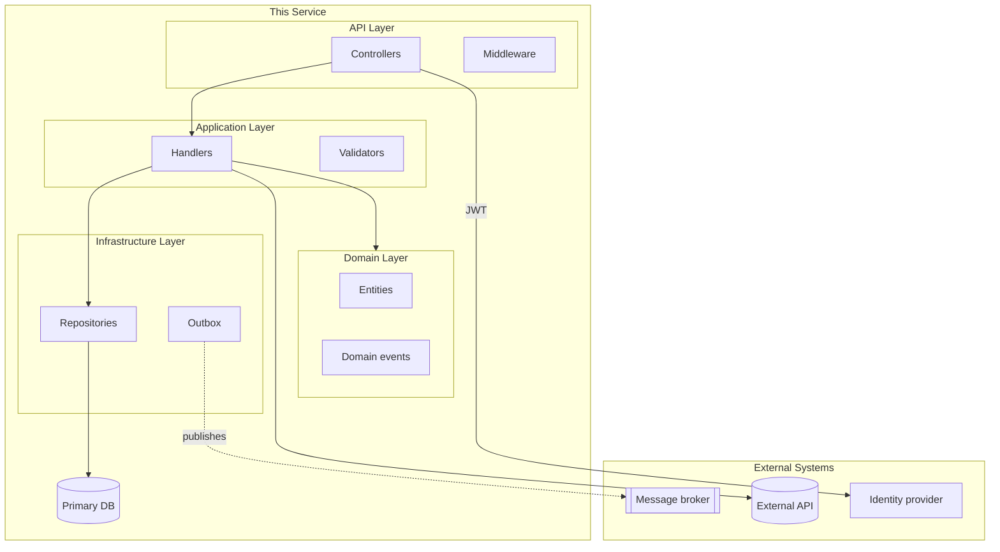
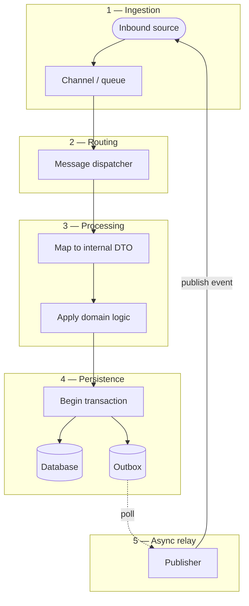
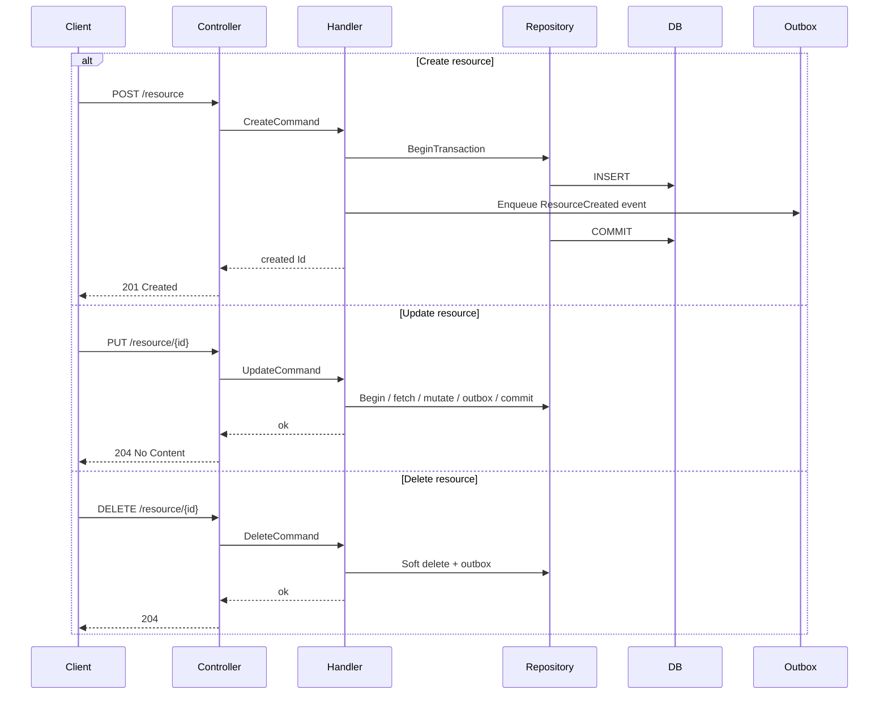
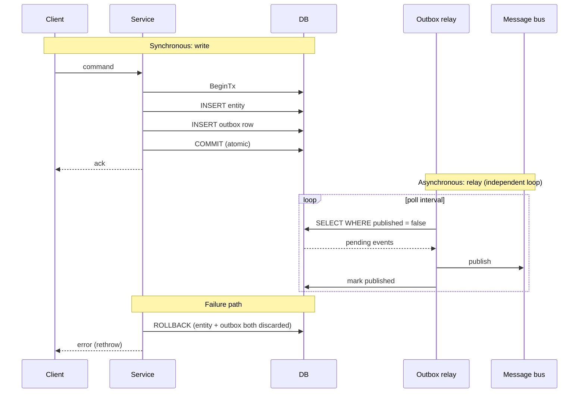
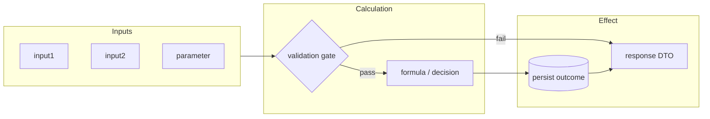
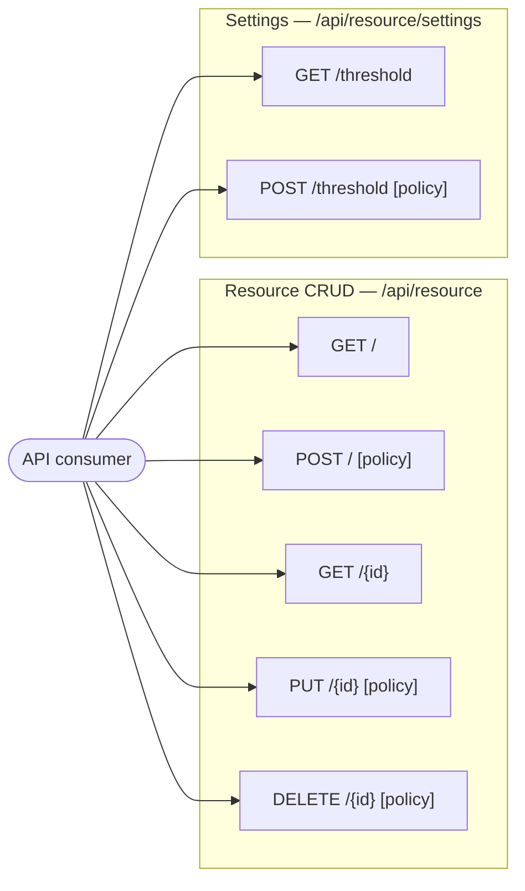
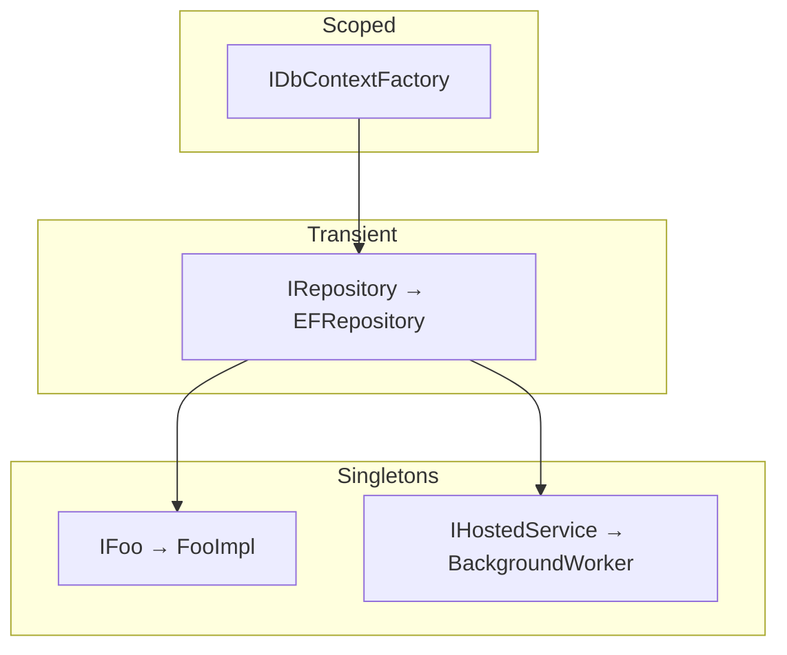
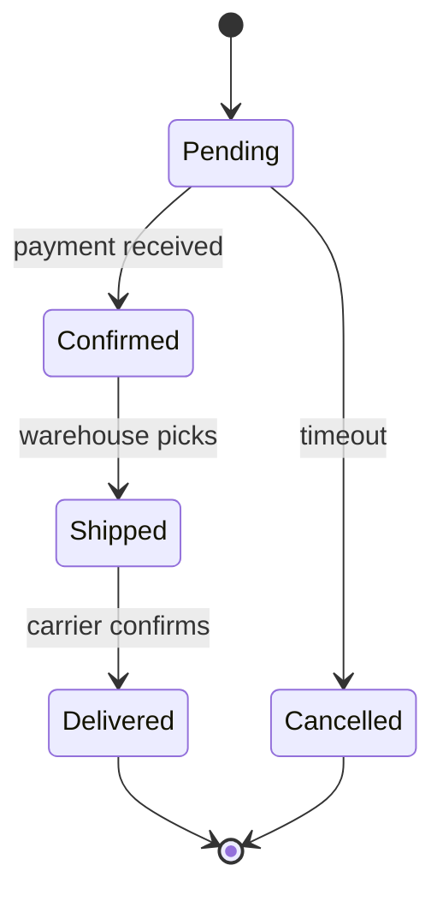
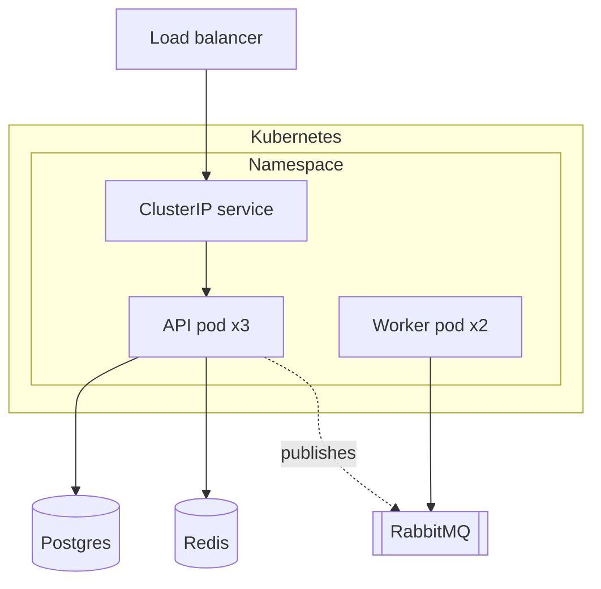

# System Design Prompt

Use this prompt to generate a comprehensive `docs/system-design.md` for the
project, with mermaid diagrams for architecture, end-to-end workflow, key
flows, data model, and any project-specific aspects (DI map, REST surface,
algorithms, registries) that the codebase actually warrants.

To use: open Claude Code in the project and type
`Use prompts/system-design.md`.

This is heavier than other prompts — it scans the whole project, reasons
about architecture, and produces a multi-section document with several
diagrams. Plan for 5–10 minutes.

---

I want a comprehensive system-design document for this project. Once I have
said `yes` to generation, **proceed end-to-end without per-section pauses**.
There is exactly ONE approval gate — at the very end, before the file is
written to disk.

## What you produce

A single Markdown file at `docs/system-design.md`. The structure is:

- **Always include** (if the project has the relevant aspect)
- **Conditionally include** — pick based on project signals (decide silently; tell me which you skipped at the gate)
- **Always end with** Key Design Decisions and Technology Stack

Section numbering is dynamic — assign 1, 2, 3, … in the order produced.
Update the Table of Contents to match.

### Always-include sections

| Section | Diagram | Purpose |
|---------|---------|---------|
| Table of Contents | (none) | Numbered anchor links to every other section. Auto-generated from the section list you actually emit. Anchors: `#N-section-name` (lowercased, hyphens for spaces) |
| Overview | (none) | One-paragraph problem statement, primary users, key responsibilities (bulleted list), and supported scope (e.g., supported entity types, integration partners). Read like a senior engineer explaining the service. |
| System Architecture | `graph TB` | One consolidated diagram showing **internal layers + external systems together**, grouped by `subgraph`. External systems on the periphery, owned components inside. If the diagram exceeds 15 nodes, split into two: high-level (subgraph boundaries only) + detail (one subgraph zoomed in). |
| Key Flow Sequences | `sequenceDiagram` | 3–5 top user / message journeys end-to-end. Use `alt`/`else` branches to capture variants in one diagram (e.g., MeasurementMessage / ConfigAdded / ConfigUpdated / ConfigDeleted in a single message-processing diagram is better than four separate ones). |
| Data Model | `erDiagram` | Key entities + relationships. Pick the spine (5–10 entities); footnote-omit the long tail. Show inheritance / TPT / TPH explicitly via the `||--o\|` notation with labelled relationships. |
| Key Design Decisions | (none, prose) | H3 per decision: 1-line decision, 2–4 sentences of rationale, optional trade-off in the same paragraph. Cover decisions that diverge from common .NET defaults (xUnit, EF Core, Polly v8, OpenTelemetry, FluentValidation) — those are especially worth listing. |
| Technology Stack | (none, table) | 4-column table: `Layer \| Technology \| Version \| Purpose`. Versions read from real artefacts (csproj, packages.lock.json, Dockerfile base). Use `Any` if version is unconstrained, `unknown` if you genuinely can't find it. |

### Conditionally-include sections (decide silently from project signals)

Include each only if the trigger applies. List which you skipped (and why) at the approval gate.

| Section | Diagram | Include when | Skip note |
|---------|---------|--------------|-----------|
| End-to-End Workflow | `flowchart TD` with **numbered subgraphs** | Project has a clear multi-stage pipeline (≥ 3 distinct phases — e.g., Ingest → Process → Persist → Relay) | Skip if the architecture diagram already conveys the full lifecycle |
| Outbox / Event-Relay Pattern | `sequenceDiagram` (sync + async paths) | Codebase implements outbox, saga, change-data-capture, or any "write-then-async-publish" pattern | Skip if no async event relay exists |
| Domain Algorithm | `flowchart LR` (inputs → calc → effect) | Project has non-trivial domain calculation that drives behaviour (threshold engines, pricing rules, scoring, allocation) | Skip if all logic is straight CRUD |
| REST API Surface | `graph LR` with endpoint subgraphs by resource | Project exposes HTTP API with > 5 endpoints | Skip if internal-only / no HTTP surface |
| Dependency Injection Map | `graph TD` with subgraphs by lifetime (Singleton / Scoped / Transient) | DI graph is non-trivial (> 10 registrations, multi-service composition, or deliberate lifetime mixing) | Skip for trivial DI |
| State Machines | `stateDiagram-v2` | Project has explicit status / lifecycle transitions | Skip if no state-driven workflows |
| Component Descriptions | (none, prose) | Project has 3+ services / handlers worth narrative explanation **(recommended for any non-trivial project)** | Skip only if Architecture diagram is fully self-explanatory |
| Type / Domain Registry | (markdown table) | Project has a dispatch / type-catalogue pattern (instrument types, payment processors, document parsers, plug-in handlers) | Skip if no registry concept |
| Deployment Topology | `graph TD` | Project has Dockerfile + Helm / K8s / docker-compose artefacts | Skip if no deployment artefacts |
| Open Questions | (none, prose) | You couldn't determine ≥ 1 thing confidently during the scan | Skip if everything was clear |

## How to scan

Read in this order; ask before reading anything outside this list:

1. `*.sln` / `*.csproj` — target framework, packages, project structure
2. `Program.cs` / `Startup.cs` — DI registrations (drives whether DI Map is worth a section), middleware order, hosted services
3. `appsettings*.json` — connection strings, external services, feature flags (redact secrets)
4. Controllers / API surface — public routes (drives whether REST Surface is worth a section)
5. Application handlers / services / MediatR — domain operations
6. `DbContext` + `IEntityTypeConfiguration<T>` — data model
7. Domain entities — invariants, value objects, status enums (drives whether State Machines section applies)
8. `IHostedService` / `BackgroundService` — async work, outbox pollers (drives whether Outbox section applies)
9. Domain logic / calculation classes (e.g., `*.Calculations.*`, `*Engine`, `*Strategy`) — drives whether Algorithm section applies
10. `.claude/lessons.md`, `.claude/context/architecture.md`, `.claude/context/tech-stack.md`, `.claude/context/coding-standards.md` — known facts (treat as authoritative over inference); `.claude/session-log.md` for recent activity context
11. `Dockerfile`, `helm/`, `k8s/`, CI workflow files — deployment shape

## Workflow

### Step A — Pre-flight (silent)
- Confirm `dotnet build` is clean (or accept my "skip").
- Confirm `docs/` exists; if not, create it as part of Step C.
- Read `.claude/lessons.md` first — it overrides any inference from code.
- **Decide which conditional sections apply** based on the scan signals above. Do not ask me — make the call and move on.

Don't ask me to confirm pre-flight; just do it. If something genuinely
blocks (project doesn't compile and you can't reason), report and stop.

### Step B — Generate the complete document (no pauses)

Produce the whole document in **one response**, in this order:

1. H1 title (e.g., `# {Project} — System Design Document`)
2. Section 1: Table of Contents (numbered links to every section you actually emit)
3. Always-include sections in their natural order
4. Conditional sections you decided to include (interleaved naturally — e.g., End-to-End Workflow right after System Architecture; Outbox / Algorithm before Component Descriptions; REST API Surface and DI Map before the closing sections)
5. Component Descriptions (if included) — H3 per major component, 2–4 sentence prose
6. Type / Domain Registry (if included) — markdown table
7. Open Questions (if any)
8. **Key Design Decisions** (always; H3 per decision)
9. **Technology Stack** (always; 4-column table)

Apply the diagram quality rules below to every diagram as you draft. Do
NOT pause between sections. Do NOT ask "should I continue with the next
section?" — just continue.

### Step C — Single approval gate, then write

After the complete document is shown above, summarise:
- Sections produced (with section number + diagram type per section)
- Conditional sections **skipped** with a one-line reason each
- Number of Key Design Decisions captured
- Number of Technology Stack rows + any `unknown` versions
- Target file path: `docs/system-design.md`
- Total line count

Then ask **once**:

> "Write this to `docs/system-design.md`? Reply `write` to save,
> `revise: <what>` to change a specific section, or `cancel` to discard."

- On `write` → create `docs/` if missing, write the file, confirm written + line count.
- On `revise: <what>` → make the targeted change, show only the changed section, return to this same approval gate.
- On `cancel` → discard, confirm nothing was written.

## Diagram quality rules

- **Two views, not one mega-diagram.** If a single diagram would have
  > 15 nodes, split: high-level (3–7 nodes, subgraph boundaries only) +
  detail (one subgraph zoomed). Reference the detail from the high-level.
- **Group by responsibility**, not by file location.
- **Edges have labels** when the relationship isn't self-evident
  (`A -->|publishes event| B`, not just `A --> B`).
- **External systems shaped differently** — use `[(External API)]`,
  `[[Queue]]`, or a clearly-named subgraph (`subgraph External`) so readers
  can tell what we own vs. depend on.
- **Subgraphs labelled with a number when used for phased flows** —
  `subgraph Ingest["1 — Message Ingestion"]`. Numbers anchor the reader.
- **No mermaid styling** unless it conveys meaning (red for critical path
  is fine; pretty colours alone are not).
- **No PII or secrets** in any node label, edge label, or prose. Use role
  names ("Customer", "Order service") not real data.
- **No invented components.** Every node traces to actual code, config, or
  a documented fact in `.claude/`. If you can't trace it, ask me at Step C
  via `revise:` or park it as an Open Question.

## Mermaid templates (starting shapes — adapt to project)

### System Architecture (`graph TB` — consolidated)



### End-to-End Workflow (`flowchart TD` with numbered subgraphs)



### Key Flow Sequence (`sequenceDiagram` with `alt/else` branches)



### Outbox / Event-Relay Pattern (`sequenceDiagram` — sync + async)



### Domain Algorithm (`flowchart LR`)



### REST API Surface (`graph LR`)



### Dependency Injection Map (`graph TD` grouped by lifetime)



### Data Model (`erDiagram`)

```mermaid
erDiagram
    USER ||--o{ ORDER : places
    ORDER ||--|{ ORDER_LINE : contains
    PRODUCT ||--o{ ORDER_LINE : "appears in"

    USER  { guid id PK; string email UK }
    ORDER { guid id PK; guid user_id FK; timestamp created_at; decimal total }
```

### State Machine (`stateDiagram-v2`)



### Deployment Topology (`graph TD`)



## Format guidance for prose / table sections

### Table of Contents

```markdown
## Table of Contents

1. [Overview](#1-overview)
2. [System Architecture](#2-system-architecture)
3. [End-to-End Workflow](#3-end-to-end-workflow)
... (numbered anchors matching emitted sections)
```

GitHub auto-generates anchors from headings as `#N-section-name`
(lowercased, hyphens for spaces, ampersands stripped). Ensure each anchor
matches the actual heading.

### Overview

One paragraph stating the service's purpose. Then:
- **Responsibilities** — bulleted list, each starting with a verb (Consume, Persist, Evaluate, Publish, Expose)
- **Supported scope** — list of supported entity types / integration partners / domains, when applicable

### Component Descriptions

H3 per major component. 2–4 sentences each. Cover: what it owns, the
contract it implements, how it integrates with neighbours, any non-obvious
constraint.

### Type / Domain Registry

Markdown table indexing all instances of the project's type-catalogue
pattern. Columns adapt to the project — e.g., `# | Type | Channel |
Detail Entity | Settings Entity | Key Fields`. Footnote frozen typos /
naming constraints inline.

### Key Design Decisions (always)

H3 per decision. Each section is 2–4 sentences:
1. State the decision (the "what" + "why" in one sentence).
2. Justify the trade-off (what was given up, what was gained).
3. Optional: note the failure mode or mitigation.

Do not use a table here. Prose with H3s reads better for justifications.

Cover (at minimum, when applicable):
- Inheritance / persistence strategy choice (TPT / TPH / Single-Table)
- Storage format choices (JSON columns vs join tables)
- Dispatch strategy (`dynamic`, reflection, switch, polymorphism)
- DI lifetime decisions that diverge from defaults
- Async event delivery semantics (at-least-once / exactly-once / fire-and-forget)
- Cross-cutting concerns embedded vs extracted
- Anything that contradicts common .NET defaults (xUnit, EF Core, Polly v8, OpenTelemetry, FluentValidation)

### Technology Stack (always)

4-column markdown table:

```markdown
## Technology Stack

| Layer | Technology | Version | Purpose |
|-------|-----------|---------|---------|
| Runtime | .NET | 8.0 | Application host, async, DI container |
| Web Framework | ASP.NET Core | 8.0 | REST API, middleware pipeline |
| ORM | EF Core | 8.0.10 | Code-first, migrations, TPT inheritance |
| Database | SQL Server | Any | Primary persistence + outbox |
| Messaging | RabbitMQ | (via pkg) | Event bus |
| Auth | JWT bearer | — | Endpoint authorization |
| API Docs | Swashbuckle | 7.1.0 | Swagger UI |
| Logging | Serilog | 3.x | Structured logs |
| Testing | xUnit | — | Unit + integration tests |
| Container | Docker | — | Production deployment |
| CI/CD | GitHub Actions | — | Build, test, image |
```

Group rows in the order: Runtime → Frameworks → Data → Messaging → Auth →
Observability → Testing → Containers → CI/CD. The `Purpose` column is
mandatory (administrative info is not).

## If `docs/system-design.md` already exists

Treat it as a **diff**, not a rewrite:

1. Read the existing file.
2. Re-scan the project.
3. Show me a section-by-section diff: what would change, what would stay,
   what's new, what would be removed.
4. **WAIT for my approval per section** before applying.
5. Preserve any custom prose I've added that doesn't conflict with current
   reality.

## Greenfield / small projects

If the project is small (< 5 controllers, < 10 entities, no deployment
artefacts), produce a **brief** doc — one page, maybe two diagrams (System
Architecture + Data Model) plus the always-end sections (Key Design
Decisions + Technology Stack). Don't pad. Tell me at Step C that you
produced a brief version and why.

## Rules (do not violate)

- Never invent components. Every node / row traces to code, config, or
  documented fact.
- Never pause between sections. The user said `yes` once; produce the
  whole document in a single response. The only approval gate is at the
  end (Step C).
- Never write `docs/system-design.md` without my explicit `write` reply
  at Step C.
- Never include PII or secrets in any diagram or prose.
- Conditional sections are decided silently at pre-flight; do not ask
  whether to include them.
- For greenfield / small projects, abbreviate honestly. Two diagrams +
  short prose is fine; padding is not.
- If you can't determine something confidently, surface it in the Open
  Questions section (if you decided to include one) — don't guess, don't
  pause to ask.
- Treat `.claude/lessons.md` as authoritative when it contradicts your
  inference from code.
- After writing the file, do NOT also write a summary into
  `.claude/lessons.md` or any `.claude/context/` file. The system-design
  doc lives at `docs/system-design.md` and is its own artefact.
